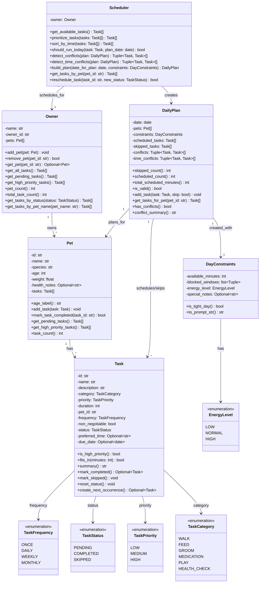

# PawPal+ Class Diagram

## Class Descriptions

### Owner
Manages multiple pets and provides access to all their tasks.
- **Attributes:** name, owner_id, pets (list of Pet objects)
- **Methods:** 
  - `add_pet()`: Add a pet to the owner's collection
  - `remove_pet()`: Remove a pet by ID
  - `get_pet()`: Retrieve a specific pet by ID
  - `get_all_tasks()`: Flattened list of all tasks across all pets
  - `get_pending_tasks()`: All pending tasks across all pets
  - `get_high_priority_tasks()`: All high-priority tasks across all pets
  - `get_tasks_by_status()`: Tasks matching a given status
  - `get_tasks_by_pet_name()`: All tasks for a named pet

### Pet
Represents a pet that needs care.
- **Attributes:** id, name, species, age (in years), weight, health_notes (optional), tasks (list of Task objects)
- **Methods:** 
  - `age_label()`: Returns a human-readable age description (Kitten/Puppy, Young, Adult, Senior)
  - `add_task()`: Add a task to this pet
  - `mark_task_completed()`: Mark a task as completed by ID; automatically creates next occurrence if recurring
  - `get_pending_tasks()`: Return all pending tasks for this pet
  - `get_high_priority_tasks()`: Return all high-priority tasks for this pet
  - `task_count()`: Return total number of tasks for this pet

### Task
Represents a care task for a specific pet.
- **Attributes:** id, name, description, category (TaskCategory enum), priority (TaskPriority enum), duration (minutes), pet_id, frequency (TaskFrequency enum), non_negotiable, status (TaskStatus enum), preferred_time (optional HH:MM format), due_date (optional)
- **Methods:**
  - `is_high_priority()`: Returns true if priority is HIGH
  - `fits_in(minutes)`: Returns true if task duration ≤ available minutes
  - `summary()`: Returns a formatted summary of the task
  - `mark_completed()`: Mark task as completed; creates and returns next occurrence if recurring
  - `mark_skipped()`: Mark task as skipped
  - `reset_status()`: Reset task status to pending
  - `create_next_occurrence()`: Create the next occurrence of a recurring task

### Scheduler
Retrieves, prioritizes, and schedules tasks across all of an owner's pets.
- **Attributes:** owner (Owner object)
- **Methods:**
  - `get_available_tasks()`: Return all pending tasks from the owner's pets
  - `prioritize_tasks()`: Sort tasks by non-negotiable flag, priority, and time preference
  - `sort_by_time()`: Sort tasks by preferred_time
  - `should_run_today()`: Check if recurring task should be scheduled for a given date
  - `detect_conflicts()`: Return task pairs with behavioral conflicts (same pet, incompatible categories)
  - `detect_time_conflicts()`: Return task pairs with overlapping time windows
  - `build_plan()`: Build a priority-ordered daily plan, scheduling tasks that fit
  - `get_tasks_by_pet()`: Get all pending tasks for a specific pet
  - `reschedule_task()`: Update a task's status and handle recurring task logic

### DayConstraints
Represents constraints and context for a specific day's planning.
- **Attributes:** available_minutes, blocked_windows (list of time windows), energy_level (EnergyLevel enum), special_notes (optional)
- **Methods:**
  - `is_tight_day()`: Returns true if available time < 180 minutes
  - `to_prompt_str()`: Formats constraints as a string for AI/scheduler input

### DailyPlan
Represents a complete schedule for one day across all pets.
- **Attributes:** date, pets, constraints (DayConstraints), scheduled_tasks, skipped_tasks, conflicts (behavioral conflicts), time_conflicts (overlapping time windows)
- **Methods:**
  - `skipped_count()`: Return number of skipped tasks
  - `scheduled_count()`: Return number of scheduled tasks
  - `total_scheduled_minutes()`: Return total duration of all scheduled tasks
  - `is_valid()`: Return true if scheduled tasks fit within constraints
  - `add_task()`: Add a task to the plan (scheduled or skipped)
  - `get_tasks_for_pet()`: Return all tasks scheduled for a specific pet
  - `has_conflicts()`: Return true if any conflicts detected
  - `conflict_summary()`: Return human-readable summary of all conflicts

### Enumerations
- **TaskFrequency:** ONCE, DAILY, WEEKLY, MONTHLY
- **TaskStatus:** PENDING, COMPLETED, SKIPPED
- **TaskPriority:** LOW, MEDIUM, HIGH
- **TaskCategory:** WALK, FEED, GROOM, MEDICATION, PLAY, HEALTH_CHECK
- **EnergyLevel:** LOW, NORMAL, HIGH

## Relationships

- **Owner → Pet** (1:*): An owner manages multiple pets
- **Pet → Task** (1:*): Each pet has multiple tasks
- **Scheduler → Owner** (1:1): Scheduler works with an owner's account
- **Scheduler → DailyPlan** (→): Scheduler creates daily plans
- **DailyPlan → Pet** (1:*): One plan covers multiple pets
- **DailyPlan → DayConstraints** (1:1): A plan is created with specific day constraints
- **DailyPlan → Task** (1:*): A plan references multiple scheduled and skipped tasks
- **Task → Enums**: Task references TaskFrequency, TaskStatus, TaskPriority, and TaskCategory
- **DayConstraints → EnergyLevel**: Day constraints include energy level enum

## Design Rationale

✓ **Owner-centric model:** Owner manages all pets and tasks, providing a clear ownership hierarchy  
✓ **Multi-pet support:** One daily plan covers all pets, enabling coherent scheduling across all  
✓ **Recurrence handling:** Tasks automatically generate next occurrences when completed  
✓ **Time-aware scheduling:** Tasks support preferred times and duration, enabling conflict detection  
✓ **Flexible frequency:** Tasks support ONCE, DAILY, WEEKLY, MONTHLY frequencies with due dates  
✓ **Conflict detection:** System detects both behavioral conflicts (incompatible categories) and time-based conflicts (overlapping schedules)  
✓ **Status tracking:** Tasks track PENDING, COMPLETED, and SKIPPED states with proper state transitions
