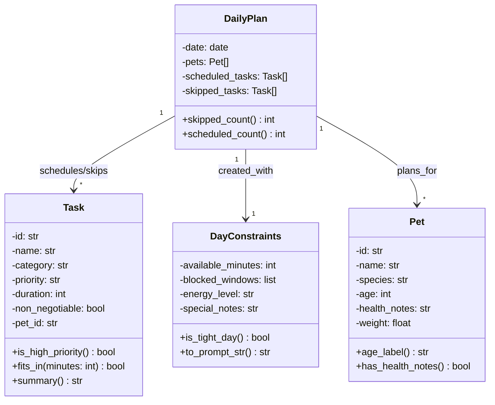

# PawPal+ Class Diagram

## Class Descriptions

### Pet
Represents a pet that needs care.
- **Attributes:** id (unique identifier), name, species, age (in years), health_notes (medical considerations), weight
- **Methods:** 
  - `age_label()`: Returns a human-readable age description
  - `has_health_notes()`: Checks if health notes exist

### Task
Represents a care task that must or should be completed for a specific pet.
- **Attributes:** id, name, category (walk, feed, groom, etc.), priority (low/medium/high), duration (minutes), non_negotiable (must-do tasks), pet_id (links task to its owner pet)
- **Methods:**
  - `is_high_priority()`: Returns true if priority is "high"
  - `fits_in(minutes)`: Returns true if task duration ≤ available minutes
  - `summary()`: Returns a formatted summary of the task

### DayConstraints
Represents the constraints and context for a specific day's planning.
- **Attributes:** available_minutes (total time available for tasks), blocked_windows (list of time periods unavailable), energy_level (pet's current energy), special_notes (additional context)
- **Methods:**
  - `is_tight_day()`: Returns true if available time is very limited
  - `to_prompt_str()`: Formats constraints as a string for AI/scheduler input

### DailyPlan
Represents a complete schedule for one day across all pets.
- **Attributes:** date, pets (list of pets covered by this plan), scheduled_tasks (tasks selected for the day), skipped_tasks (tasks deferred)
- **Methods:**
  - `skipped_count()`: Returns the number of skipped tasks
  - `scheduled_count()`: Returns the number of scheduled tasks

## Relationships

- **DailyPlan → Pet** (1:*): One plan covers multiple pets, allowing coherent scheduling across all pets
- **DailyPlan → DayConstraints** (1:1): A plan is created with specific day constraints
- **DailyPlan → Task** (1:*): A plan references multiple tasks (scheduled and skipped); each task links back to its owner pet via pet_id

## Design Rationale

✓ **Multi-pet support:** Owners typically manage multiple pets; one daily plan covers all  
✓ **Pet filtering:** Tasks carry `pet_id`, so filtering per pet is straightforward  
✓ **Better AI context:** Scheduler receives all pets at once for more coherent, holistic planning  
✓ **Minimal complexity:** Small addition (pets list + pet_id on Task) with major benefit
